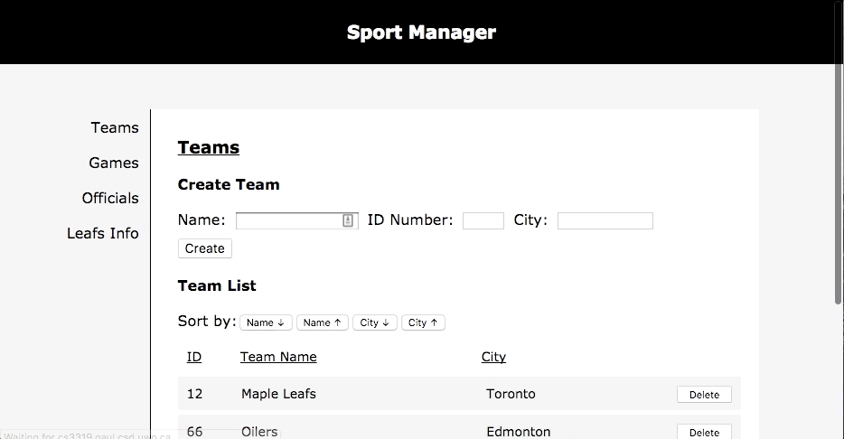
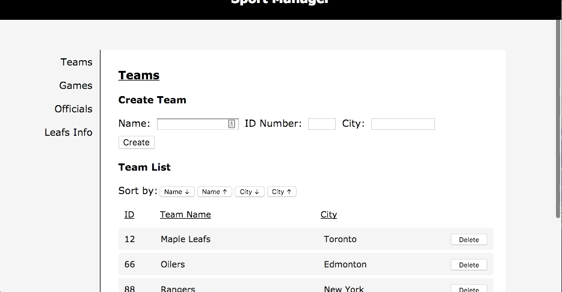

# Sport Manager

## About

Sport Manager was a website project for my databases course during my third year at university. It was built from scratch (even the dev env!) with the PERN stack (Postgres, Express, Node & React) and was developed in accordance to the assignment specifications.

## Demo

Here are some demos of its features with data in the database. Any data created, deleted or edited is immediately updated in the database.

### Team Listing

### Team Creating & Deleting

### Game Information Viewing & Location Editing

### Official List Viewing

### Leaf Game & Official Data

